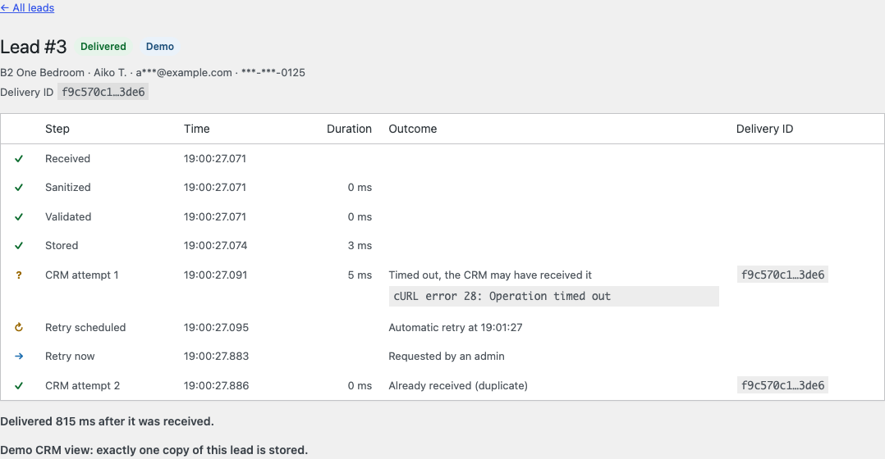
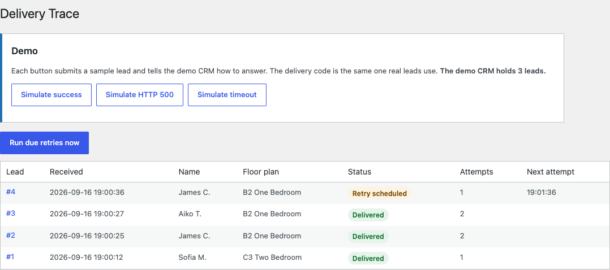

# Delivery Trace

[](https://github.com/mateusgetulio/wp-delivery-trace/actions/workflows/ci.yml)

A small WordPress plugin that stores a form lead before doing anything else, delivers it to a CRM webhook, and records every step. Demo buttons make the CRM fail on purpose, so you can watch a lead survive a server error and a timeout without being lost or duplicated.



## Run it

Needs Docker and Node.js.

```sh
git clone https://github.com/mateusgetulio/wp-delivery-trace.git
cd wp-delivery-trace
npx @wordpress/env start
```

- Tour form: http://localhost:8888/tour/
- Delivery Trace screen: http://localhost:8888/wp-admin/admin.php?page=delivery-trace (user `admin`, password `password`)

The local site runs in demo mode. The CRM URL is `https://crm.example.com/leads`, and a fake transport inside WordPress answers it, so no lead leaves your machine.

Unit tests and coding standards (these need PHP 8.0+ and Composer on your machine):

```sh
composer install
composer test
composer phpcs
```

Requires PHP 8.0+ with mbstring and WordPress 6.5+.

## The demo

Each button on the Delivery Trace screen submits a sample lead through the same code path as the public form and tells the demo CRM how to answer.

| Button | The demo CRM | What the trace shows |
|---|---|---|
| Simulate success | answers 204 | Delivered on attempt 1 |
| Simulate HTTP 500 | answers 500, then 204 | Lead stored, retry scheduled, Retry now, delivered |
| Simulate timeout | stores the lead, then the request times out | "The CRM may have received it", Retry now with the same delivery ID, "Already received (duplicate)", one copy in the CRM |

WP-Cron is disabled in this environment (`DISABLE_WP_CRON`), so retries wait for Retry now or Run due retries now. On a normal site cron runs them. The demo CRM answers instantly, so durations in demo traces are only a few milliseconds, timeouts included.



## How delivery works

1. **Received, sanitized, validated, stored.** The lead is in the database before any network call, so no CRM failure can lose it.
2. **First attempt, right away.** `wp_safe_remote_post()` with a 3 second timeout, redirects not followed, a JSON body, and the headers `Content-Type: application/json`, `Idempotency-Key` with the lead's UUID, and `Authorization: Bearer` with the token.
3. **The result is classified.**

| Response | Outcome | Next |
|---|---|---|
| 2xx | delivered | done |
| 409, or 2xx with `{"duplicate": true}` | delivered, duplicate | done |
| 408, 429, 5xx | retryable | retry; a `Retry-After` of up to 15 minutes can lengthen the wait, never shorten it |
| 401, 403 | auth failed | needs attention |
| any other status, including a 3xx | rejected | needs attention, scrubbed response body shown |
| cURL error 28 (timeout) | unknown: the CRM may have it | retry with the same key |
| any other transport error | unreachable | retry |
| URL or token not defined, or a demo lead while the URL is not the demo CRM | misconfigured | needs attention, nothing is sent |

4. **Retries** 1, 5 and 15 minutes after the previous attempt. By default, after 4 attempts the lead needs attention; manual and interrupted attempts count too. Permanent failures are never retried automatically. Retry now works on any lead that is not delivered and not in the middle of an attempt.
5. **One attempt at a time.** Before each attempt the lead is claimed with a single conditional `UPDATE` on its status, attempt count and lock. Two runners cannot send the same lead as long as an attempt finishes within its 60 second lock, which the 3 second timeout makes very likely. A lead left mid-attempt by a PHP process that died is picked up again once its 60 second lock expires, and the trace records it as an interrupted attempt with an unknown outcome.

Each retry is one WP-Cron event, but the lead's `next_attempt_at` decides whether it runs, so a stale event does nothing. A sweep every five minutes picks up lost events, expired locks and first attempts that never started.

## Decisions and trade-offs

- **No nonce on the public form.** Public submissions intentionally do not use WordPress nonces, because the form may be served from full-page cache and does not perform an authenticated action. A honeypot and a minimum fill time filter bots, and submissions without JavaScript are accepted and flagged. Administrative actions use capability checks and nonces.
- **The first attempt is synchronous.** In production I would queue delivery right after the lead is stored. The prototype sends the first attempt synchronously so the delivery state is visible without depending on cron for the normal case. The visitor waits about 3 seconds at most and sees the same confirmation whatever the CRM does.
- **A timeout means "maybe delivered".** The CRM may have processed the request and only the answer was lost. The retry reuses the idempotency key, so a CRM that honors it answers with a duplicate instead of creating a second lead. Every cURL error 28 counts, even a connect timeout, because assuming the CRM may have the lead is the safe side.
- **WP-Cron and when to replace it.** WP-Cron only runs when someone loads a page, and many small sites get little traffic. Set `DISABLE_WP_CRON` and call `wp-cron.php` from a server cron every minute. For high volume, move delivery to Action Scheduler or a real queue.
- **Custom tables, not a post type.** A lead has many events, and "which leads are due" needs an indexed query.
- **The demo replaces the network, not the delivery code.** In demo mode a `pre_http_request` filter answers requests for `crm.example.com` before WordPress resolves the host. The delivery code still calls `wp_safe_remote_post()` and does not know. Point `DELIVERY_TRACE_CRM_URL` at a request inspector such as webhook.site and the same code makes real requests. The demo buttons only appear while the URL points at the demo host, and a demo lead is never sent anywhere else: if the URL changes while one is waiting for a retry, the attempt is recorded as misconfigured instead.
- **Redirects are not followed.** A redirect would send the `Authorization` header to another host, and a 302 turned into a GET could look like a successful delivery.
- **`Retry-After` is capped at 15 minutes** so one response cannot park a lead for hours. The trade-off is that a retry may arrive before a very long `Retry-After` has passed.
- **The plugin runs without Composer.** A small autoloader loads `src/`. `vendor/` only holds development tools.

## Personal data

- The full lead is stored once, because a retry needs the real email and phone.
- The admin screens only show masked values: `Sofia M.`, `s***@example.com`, `***-***-0187`.
- Only failures that need a person keep the CRM's response body; transport errors keep their message. Both are scrubbed of the lead's name and each part of it, the email (also URL-encoded) and the phone digits (also the last ten, for numbers echoed without a country code) before they are stored, then cut to 500 characters. The plugin writes nothing from the lead to logs.
- When the form has errors, the sanitized values wait in a transient for up to 10 minutes so the visitor does not retype them. It is deleted as soon as the form shows them again.
- In a production deployment, storage should follow the site's retention, access-control and encryption requirements. This prototype stores the lead because retries need it, and limits exposure with masking, capability checks and scrubbed trace details. A retention purge is not built yet.

## Configuration

In `wp-config.php`:

```php
define( 'DELIVERY_TRACE_CRM_URL', 'https://crm.example.com/leads' );
define( 'DELIVERY_TRACE_CRM_TOKEN', 'your-token' );
define( 'DELIVERY_TRACE_DEMO', true );
```

- Shortcode: `[delivery_trace_tour_form]`
- Filter `delivery_trace_retry_schedule`: seconds before each retry, at most three values. Fewer values mean fewer attempts. Anything that is not a list of non-negative integers falls back to 60, 300 and 900.

## What it does not do

- It is not a lead manager: no editing, assigning, exporting or searching.
- One CRM destination, and no real CRM integration.
- No notification email, no WP-CLI commands, no retention purge, and no hooks into WordPress's personal data export and erase tools.
- The lead list shows the latest 50 leads, without pagination.
- Unit tests cover the logic that does not need WordPress: classification, retry policy, masking and scrubbing. The WordPress side was tested by hand in wp-env, not with integration tests.
- The demo CRM keeps its state in one option and is not safe under concurrent requests. That is fine for one person clicking buttons.

## Debugging the same failure on a real site

When a client says leads stopped arriving:

1. **Reproduce it.** Submit the form myself and note the time.
2. **Find where the lead stopped.** If it never reached the database, the problem is before delivery: a cached page with an old form, a security plugin blocking `admin-post.php`, a JavaScript error, or a spam filter. The browser network tab and the server access log show whether the POST arrived.
3. **If it was stored, read the trace.** The status, and for permanent failures the scrubbed body, tell whether it is the token (rotated or expired), the payload (the CRM added a required field), rate limiting, or the CRM being down.
4. **Check the server.** PHP error log and `debug.log` around that time, `wp cron event list` to see whether retries are stuck because cron is not running, and outbound firewall or DNS when attempts are unreachable.
5. **Fix, then replay.** Send the same request to a request inspector, fix the cause, and use Retry now on the stuck leads instead of asking people to submit again.

## Layout

```
delivery-trace.php   bootstrap, autoloader, activation and deactivation
src/Form/            shortcode, submit handler, validation, intake
src/Delivery/        outcome classifier, retry policy, deliverer, runner
src/Storage/         schema, repositories, the claim
src/Privacy/         masker, scrubber
src/Admin/           lead list, trace, actions
src/Demo/            fake transport and its script
tests/Unit/          PHPUnit tests that do not load WordPress
```

## License

GPL-2.0-or-later.
